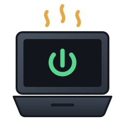

<div align="center">



# Napless

**Keep your MacBook running with the lid closed — while the screen is off.**

A small native macOS app that blocks system sleep on AC power, powers the panel
down after a configurable timeout, and restores your original power settings the
moment you quit.

[](https://www.apple.com/macos/)
[](https://www.rust-lang.org/)
[](LICENSE)

</div>

---

## The problem

MacBooks are designed to sleep when you close the lid. That is the right default
for a laptop you carry around — and the wrong behaviour when the machine is
sitting on a desk plugged into power, running a build, a backup, a render or a
long download.

The usual fixes are shell one-liners that change `pmset` values and leave them
changed. **Napless does the same thing, but properly:** it remembers your exact
settings, shows you what is running, and puts everything back on exit.

## What it does

| | |
|---|---|
| **Blocks system sleep on AC** | `sleep 0` + `disablesleep 1`, so closing the lid does not suspend the Mac |
| **Still turns the screen off** | `displaysleep` is kept at your own value, so the panel powers down instead of burning the lid |
| **Wakes on lid open** | Opening the lid brings the display straight back |
| **Restores what it changed** | The previous `sleep` / `displaysleep` / `disablesleep` values are written back on Quit, Ctrl+C, SIGTERM or SIGHUP |
| **Battery profile untouched** | Only the AC profile is ever modified |
| **Live CPU, RAM, temperature and energy** | Read from Mach, the SMC and IOKit, with `powermetrics` for system power |
| **Energy spent since start-up** | System power integrated over time into Wh or kWh |

> Lid-closed mode is a **maintenance and power-supply feature**. Running a
> MacBook sealed in a bag with the lid shut restricts airflow and stresses the
> battery. Use it on a hard, ventilated surface with the charger connected.

## Screenshot

<div align="center">


</div>

> Drop your screenshot at `docs/screenshot.png` and it will show up here.

## Install

Requires macOS 12 or newer and a Rust toolchain:

```sh
git clone git@github.com:fobaty/napless.git
cd napless
cargo build --release
```

## Usage

`pmset` only accepts privileged changes, so Napless runs as root:

```sh
sudo ./target/release/napless
```

The window opens with lid-closed mode already active. Close it and the Mac keeps
running.

```sh
sudo napless --help
```

| Option | Effect |
|---|---|
| *(none)* | Windowed mode, activates on launch |
| `--daemon` | No window, prints a status line to the terminal |
| `--no-auto-start` | Start inactive and wait for the **Activate** button |
| `--display-timeout <MIN>` | Display sleep timer for the session, `0` keeps the screen on |

Daemon mode prints live statistics:

```
Lid-closed mode is active. You can close the lid now. Press Ctrl+C to stop.
sleep=0 displaysleep=10 disablesleep=1
active for 01:24:07  |  cpu  38%  |  ram 9.4/16.0 GB  |  battery 89% charging  |  system 6.2 W  |  spent 41 Wh  |  on battery: false
```

## How it works

While a session is active:

```sh
pmset -c sleep 0 disablesleep 1 displaysleep <MIN>
```

On shutdown the snapshot taken at start-up is written back verbatim. `pmset`
reports failures on stderr while still exiting `0`, so Napless treats a non-empty
stderr as an error rather than trusting the exit status.

The **battery** gauge reads the `AppleSmartBattery` registry entry over IOKit: charge
share, charge state, and the power flowing into the pack. The charge share is derived
from `CurrentCapacity` against `MaxCapacity` rather than assumed to be a percentage,
since `MaxCapacity` is 100 on most packs but not all.

The **system** gauge reports what the machine itself draws, taken from `powermetrics`
and integrated over time into watt hours, switching to kilowatt hours past 100 Wh. The
per-subsystem power lines and the combined figure are both accepted, and a cycle is
recognised when a label repeats or the combined figure is published, so the reading
does not depend on which samplers the tool offers. `powermetrics` needs root, which
Napless already has, and it is stopped when the session ends so it never outlives it.

Two limits are worth stating plainly. Apple documents `powermetrics` output as
estimated rather than measured, so these totals approximate the real consumption.
And the figures cover the CPU, GPU and ANE subsystems, not the display, the disks or
the rest of the machine, so they sit below the true draw from the wall.

The per-application breakdown is not available. macOS exposes no unprivileged way to
attribute energy to individual apps, and the registry's `Accumulated*` telemetry is
refreshed in bursts, so differencing it over a short interval yields anything from
11 W to 190 W for the same machine. Integrating published power is the honest
alternative.

The charge share is derived from `CurrentCapacity` against `MaxCapacity` rather than
assumed to be a percentage, since `MaxCapacity` is 100 on most packs but not all.

Temperatures come straight from the System Management Controller over IOKit. The
SMC key that carries the CPU die temperature differs between Intel and Apple
silicon, so the candidates (`Tp0T`, `TC0P`, `TC0D`, `TC0H`, `Tp09`) are probed
once at start-up and the first that returns a plausible reading is used. Implausible
values are discarded and the last good reading is held briefly, so the gauge never
flashes a bogus number. A key that reads back a value is kept even when that value is
momentarily implausible, because the key list is probed only once per process and a
single placeholder sample would otherwise disable the gauge until the next restart.

## Security

Napless needs root only because `pmset` does. The privileges are scoped to the
process and are never persisted: no launch daemons, no background agents, no
changes to system files outside the three power keys it manages.

## Development

```sh
cargo test --release
cargo clippy --all-targets -- -D warnings
cargo fmt
```

## License

MIT — see [LICENSE](LICENSE).